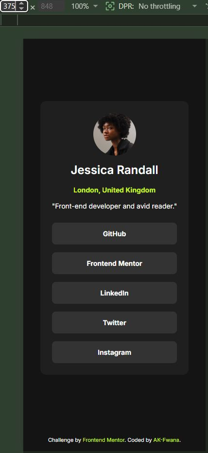
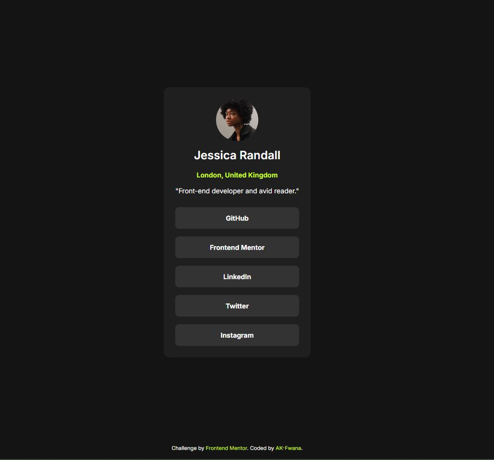

# Frontend Mentor - Social links profile solution

This is a solution to the [Social links profile challenge on Frontend Mentor](https://www.frontendmentor.io/challenges/social-links-profile-UG32l9m6dQ). Frontend Mentor challenges help you improve your coding skills by building realistic projects.

## Table of contents

- [Overview](#overview)
  - [The challenge](#the-challenge)
  - [Screenshot](#screenshot)
  - [Links](#links)
- [My process](#my-process)
  - [Built with](#built-with)
  - [What I learned](#what-i-learned)
  - [Continued development](#continued-development)
  - [Useful resources](#useful-resources)
  - [AI Collaboration](#ai-collaboration)
- [Author](#author)

## Overview

### The challenge

Users should be able to:

- See hover and focus states for all interactive elements on the page

### Screenshot

### Links

- Solution URL: [Add solution URL here](https://your-solution-url.com)
- Live Site URL: [Add live site URL here](https://your-live-site-url.com)

## My process

### Built with

- Semantic HTML5 markup
- CSS custom properties
- Flexbox
- Mobile-first workflow
- Accessibility-focused interaction states
- CSS design tokens using `:root`

### What I learned

During this project, I improved my understanding of semantic HTML structure by separating the page into meaningful sections like `main`, `article`, and `nav`.

I also learned how parent containers affect child element sizing in Flexbox layouts, especially when working with `width: 100%`.

Another important lesson was improving accessibility by adding keyboard focus states using `:focus-visible`.

I became more comfortable organizing CSS using design tokens with the `:root` pseudo-class for colors, typography, and spacing.

### Continued development

In future projects, I want to continue improving my responsive layout skills and become more confident with advanced Flexbox and CSS Grid layouts.

I also want to strengthen my accessibility knowledge and start learning JavaScript for interactive frontend projects.

### Useful resources

### Useful resources

- [MDN Web Docs](https://developer.mozilla.org/) - Helped me better understand semantic HTML and CSS properties.
- [Frontend Mentor](https://www.frontendmentor.io/) - Provided a realistic frontend workflow and responsive design practice.
- [Google Fonts](https://fonts.google.com/) - Used to import and apply the Inter font family.

### AI Collaboration

During this project, I used ChatGPT as a frontend development assistant to help guide me through the project step by step.

The AI helped me:

- Understand semantic HTML structure
- Debug Flexbox and width issues
- Organize CSS using design tokens and reusable variables
- Improve accessibility with hover and focus states
- Follow a mobile-first responsive workflow

The most useful part was learning the reasoning behind layout and CSS decisions instead of only receiving direct solutions.

## Author

- GitHub - [AK-Fwana](https://github.com/AK-Fwana)
- Frontend Mentor - [@AK-Fwana](https://www.frontendmentor.io/profile/AK-Fwana)
